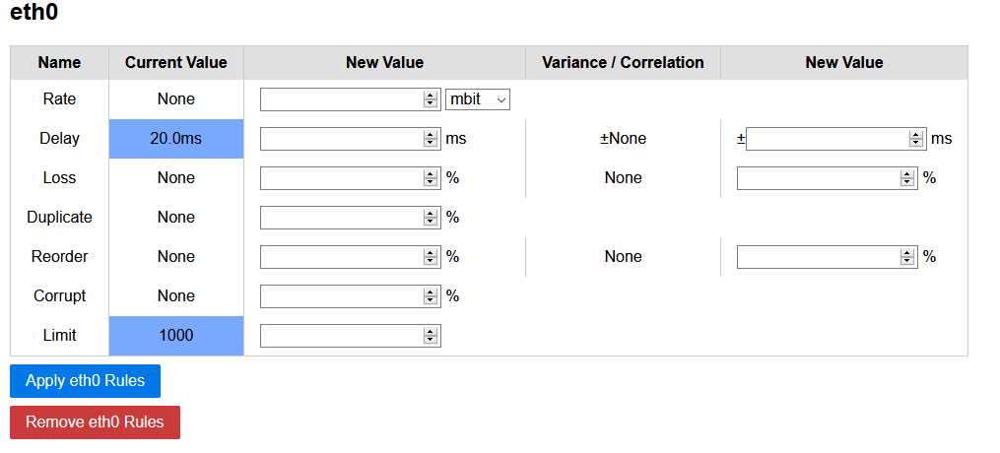

# tcgui

A lightweight Python-based Web-GUI for Linux traffic control (`tc`) to set, view and delete traffic shaping rules. The Web-GUI is intended for short-term isolated testbeds or classroom scenarios and does not contain any security mechanisms.

No further changes are planned right now, but pull requests are welcome.



## Requirements

- Tested with Ubuntu 16.04 LTS & Ubuntu 18.04 LTS & Raspbian 4.14.98-v7+ (stretch, Debian 9.8)
- `netem` tools & `python3-flask` are required
    - Ubuntu 16.04 : Install with `sudo apt-get install iproute python3-flask`
    - Ubuntu 18.04 : Install with `sudo apt-get install iproute2 python3-flask`
- More information:
    - https://calomel.org/network_loss_emulation.html
    - https://wiki.linuxfoundation.org/networking/netem

## Usage

- Execute the main.py file and go to http://localhost:5000:
    
    ```
    sudo python3 main.py
    
    --ip IP               The IP where the server is listening
    --port PORT           The port where the server is listening
    --dev [DEV [DEV ...]] The interfaces to restrict to
    --regex REGEX         A regex to match interfaces
    --debug               Run Flask in debug mode
    ```

- The tool will read your interfaces and the current setup every time the site is reloaded

## Test & Develop

You can use the supplied Vagrantfile to test tcgui quickly. Vagrant will setup two machines, sender (192.168.210.2) and a receiver (192.168.210.3):

	vagrant up

Afterwards connect to the sender and start the GUI:

	vagrant ssh sender
	cd /vagrant
	sudo python3 main.py --ip 0.0.0.0 --debug

Start a receiver in the receiving VM:

	vagrant ssh receiver
	iperf3 -s
	
Send a packet stream from the sender to the receiver:

	vagrant ssh sender
	iperf3 -c 192.168.210.3 -t 300

Now access the GUI at http://192.168.210.2:5000/ and change the rate of interface eth1. You should see the sending/receiving rate to decrease to the set amount.

